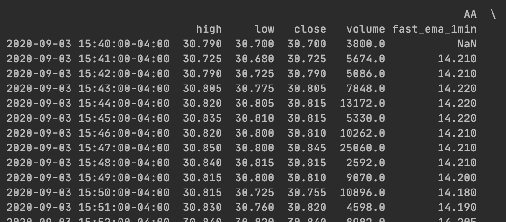

# ALPACA-TRADING-BOT
This a simple trading bot/framework based on Alpaca API. **It conducts a simple trading strategy that buys stocks when its fast moving average exceeds its slow moving average, and liquidates equity position when its fast moving average goes below its slow moving average. It checks the status every minute.** You need to sign up an Alpaca trading account. **Make sure to add your own indicators and signals.**

## Installation
Use the package manager pip to install.
```bash
pip install -r requirements.txt
```

## Usage
Go to config file and input your Alpac API key and secret key
```python
API_KEY = "<Your API here>"
SECRET_KEY = "<Your secret key here>"

api = tradeapi.REST(API_KEY,
                    SECRET_KEY,
                    'https://paper-api.alpaca.markets')
```
Then, list the stocks you want to trade in 
```python
symbols = ['AA', 'AAL', 'UAL', 'NIO', 'AMD', 'NCLH', 'BYND', 'DAL', 'ATVI', 'WORK', 'VIRT', 'AAPL', 'AMC', 'TSLA']
```
and number of shares you want to purchase each time (the example here is to buy more shares for small-cap stocks and less shares for large-cap stocks)
```python
loading = {
    'AA': 100,
    'AAL': 100,
    ... 
    'AMC': 200,
    'TSLA': 40}
```
Last, set the slow and fast moving average and time frequency data for your dataframe.
```python
slow = 20
fast = 1
freq = '1Min'
```

## Data frame structure
In StockInfo class, dataframe will be created such as :


Based on indicators in dataframe, trading signals can be created as  
```python
signals = {
    'AA': 100,
    'AAL': 0,
    ... 
    'AMC': 0,
    'TSLA': -40}
```
This signal suggests to buy 100 shares of AA and liquidate 40 shares of TSLA.
**Again, make sure to add you own indicators in dataframe.**

## Start trading

Go to **bot.py** and run it. 

Each transaction will be logged like:


## House keeping
All transactions will be kept in the log folder.

This algo uses New York local time(EST time zone). You might need to adjust daylight saving time based on your location.

## Disclaimer
This project is only for educational purpose only and it does not constitute legal, tax, regulatory, professional, financial or investment advice. 

## Contributing
Pull requests are welcome. For major changes, please open an issue first to discuss what you would like to change.

Please make sure to update tests as appropriate.
